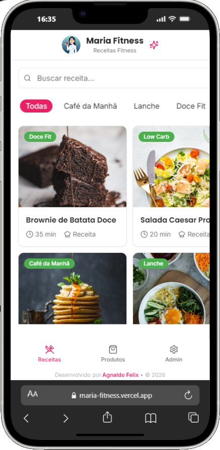

# 🏋️ Maria Fitness

> **Receitas Fitness & Produtos Saudáveis** | Uma plataforma moderna para compartilhar receitas deliciosas e vender produtos fitness com integração WhatsApp

[](https://vitejs.dev)
[](https://react.dev)
[](https://www.typescriptlang.org)
[](https://tailwindcss.com)
[](https://heroui.com)
[](https://supabase.com)
[](https://web.dev/progressive-web-apps/)

---

## 📱 Visão Geral

**Maria Fitness Hub** é uma aplicação web moderna e responsiva construída para Maria compartilhar receitas fitness e vender produtos saudáveis. Com um design intuitivo otimizado para mobile, integração WhatsApp seamless e um painel administrativo poderoso.

### ✨ Destaques Principais

- 🍽️ **Catálogo de Receitas** - Browsável com filtro por categorias e busca em tempo real
- 🛍️ **Loja de Produtos** - Venda de produtos fitness diretamente via WhatsApp
- 👨‍💼 **Painel Admin** - Gerenciamento completo de receitas e produtos
- 📱 **PWA Completo** - Funciona offline e pode ser instalado na tela inicial
- 🎨 **Design Moderno** - Interface com Tailwind CSS + HeroUI Components
- ⚡ **Performance** - Carregamento rápido com Vite e React Query
- 🔐 **Seguro** - Autenticação e autorização com Supabase
- 📲 **Integração WhatsApp** - Compartilhe receitas e venda produtos direto no chat
- 💬 **Notificações** - Sistema de popup para comunicados importantes

---

## 🚀 Funcionalidades

### Para Usuários

| Feature | Descrição |
|---------|-----------|
| 🔍 **Busca de Receitas** | Encontre receitas por nome ou ingrediente em tempo real |
| 🏷️ **Filtro por Categoria** | Organize por: Café da Manhã, Lanche, Doce Fit, Low Carb, Proteico |
| 📋 **Instruções Detalhadas** | Modo de preparo com passos numerados e formatação automática |
| 📸 **Galeria de Imagens** | Visualize as receitas com fotos de alta qualidade |
| 💬 **Chat WhatsApp** | Tire dúvidas sobre receitas direto pelo WhatsApp |
| 🛒 **Compra de Produtos** | Adquira produtos fitness com um clique |
| 📥 **Compartilhamento** | Copie receitas ou compartilhe via WhatsApp |
| 💾 **Modo Offline** | Acesse conteúdo já carregado sem internet |
| ⭐ **Favoritos** | Marque receitas favoritas para acesso rápido |
| 🔔 **Notificações** | Receba avisos sobre novas receitas e promoções |

### Para Administradores

| Feature | Descrição |
|---------|-----------|
| ➕ **Criar Receitas** | Adicione novas receitas com ingredientes e modo de preparo |
| ✏️ **Editar Receitas** | Atualize receitas existentes com validação de dados |
| 🗑️ **Deletar Receitas** | Remova receitas do catálogo com confirmação |
| 📤 **Publicar/Despublicar** | Controle quais receitas são visíveis aos usuários |
| 🎨 **Gerenciar Produtos** | CRUD completo de produtos com preços |
| 💰 **Controle de Preços** | Defina e atualize preços em tempo real |
| 📊 **Dashboard** | Visualize estatísticas e gerenciar conteúdo |
| ⚙️ **Configurações** | Gerencie número WhatsApp, mensagens e configs |
| 🔐 **Controle de Acesso** | Sistema de proteção por IP para admin |
| 📢 **Gerenciamento de Notificações** | Crie e ative notificações para usuários |
| 📋 **Copiar para Canva** | Formate receitas prontas para design no Canva |

---

## 🛠️ Tech Stack

### Frontend
- **Framework**: React 18 + TypeScript
- **Build Tool**: Vite
- **Styling**: Tailwind CSS
- **UI Components**: HeroUI + shadcn/ui
- **Icons**: Lucide React
- **State Management**: TanStack Query (React Query)
- **Routing**: React Router v6
- **HTTP Client**: Axios via Supabase SDK
- **Date Formatting**: date-fns

### Backend & Database
- **Backend**: Supabase (PostgreSQL)
- **Auth**: Supabase Auth + Custom IP Auth
- **Realtime**: Supabase Realtime
- **Storage**: Supabase Storage
- **Database**: PostgreSQL com RLS

### Development
- **Testing**: Vitest + React Testing Library
- **Linting**: ESLint
- **Package Manager**: Bun / npm / yarn
- **Version Control**: Git + GitHub

### Deployment
- **Hosting**: Vercel / Netlify
- **Database**: Supabase Cloud
- **PWA**: Service Workers
- **CDN**: Vercel Edge Network

---

## 📦 Instalação

### Pré-requisitos

- Node.js 18+ ou Bun
- npm/yarn/bun
- Conta Supabase (gratuita em [supabase.com](https://supabase.com))
- Git

### Clone & Setup

```bash
# 1️⃣ Clone o repositório
git clone https://github.com/seu-usuario/maria-fitness-hub.git
cd maria-fitness-hub

# 2️⃣ Instale as dependências
npm install
# ou com Bun:
bun install
# ou com Yarn:
yarn install

# 3️⃣ Configure as variáveis de ambiente
cp .env.example .env.local
# Edite .env.local com suas credenciais Supabase

# 4️⃣ Inicie o servidor de desenvolvimento
npm run dev
# Acesse http://localhost:5173
```

### Variáveis de Ambiente

Crie um arquivo `.env.local` na raiz do projeto:

```env
# Supabase Configuration
VITE_SUPABASE_URL=https://seu-projeto.supabase.co
VITE_SUPABASE_ANON_KEY=sua-chave-anonima-aqui

# Admin Access (Optional)
VITE_ADMIN_IPS=192.168.1.1,10.0.0.1
```

**Como obter as credenciais Supabase:**
1. Acesse [supabase.com](https://supabase.com)
2. Crie um novo projeto
3. Vá para Settings > API
4. Copie `Project URL` e `anon public` key

---

## 📁 Estrutura do Projeto

```
maria-fitness-hub/
├── public/                           # Assets estáticos
│   ├── day.png                       # Logo da aplicação
│   ├── manifest.json                 # PWA Manifest
│   └── robots.txt                    # SEO
│
├── src/
│   ├── components/                   # Componentes React
│   │   ├── Header.tsx                # Cabeçalho com logo
│   │   ├── BottomNav.tsx             # Navegação inferior
│   │   ├── CategoryFilter.tsx        # Filtro de categorias
│   │   ├── RecipeCard.tsx            # Card de receita
│   │   ├── ProductCard.tsx           # Card de produto
│   │   ├── RecipeModal.tsx           # Modal de detalhes da receita
│   │   ├── RecipeFormDialog.tsx      # Form para criar/editar receita
│   │   ├── ProductFormDialog.tsx     # Form para criar/editar produto
│   │   ├── NotificationManager.tsx   # Gerenciador de notificações
│   │   ├── NotificationPopup.tsx     # Popup de notificações
│   │   ├── Footer.tsx                # Rodapé
│   │   └── ui/                       # Componentes base (shadcn)
│   │       ├── button.tsx
│   │       ├── card.tsx
│   │       ├── input.tsx
│   │       ├── dialog.tsx
│   │       ├── tabs.tsx
│   │       ├── badge.tsx
│   │       ├── alert.tsx
│   │       └── ...
│   │
│   ├── pages/                        # Páginas da aplicação
│   │   ├── Receitas.tsx              # Página de receitas
│   │   ├── Produtos.tsx              # Página de produtos
│   │   ├── Admin.tsx                 # Painel administrativo
│   │   └── NotFound.tsx              # 404
│   │
│   ├── hooks/                        # Custom React Hooks
│   │   ├── useRecipes.ts             # Hook para receitas (CRUD)
│   │   ├── useProducts.ts            # Hook para produtos (CRUD)
│   │   ├── useSettings.ts            # Hook para configurações
│   │   ├── use-toast.ts              # Hook para notificações
│   │   ├── useIPAuth.ts              # Hook para autenticação por IP
│   │   └── useNotificationPopup.ts   # Hook para popup
│   │
│   ├── integrations/                 # Integrações externas
│   │   └── supabase/
│   │       ├── client.ts             # Cliente Supabase
│   │       └── types.ts              # Types gerados
│   │
│   ├── utils/                        # Funções utilitárias
│   │   ├── utils.ts                  # cn() e helpers
│   │   └── notificationStorage.ts    # Gerenciamento local de notificações
│   │
│   ├── lib/                          # Bibliotecas utilitárias
│   │   └── utils.ts                  # Funções auxiliares
│   │
│   ├── test/                         # Testes
│   │   ├── setup.ts
│   │   └── example.test.ts
│   │
│   ├── types.ts                      # Types globais
│   ├── App.tsx                       # Componente raiz
│   ├── App.css                       # Estilos da app
│   ├── index.css                     # Estilos globais
│   ├── main.tsx                      # Entry point
│   └── vite-env.d.ts                 # Types Vite
│
├── supabase/
│   ├── config.toml                   # Configuração local
│   └── migrations/                   # Migrações SQL
│       ├── 20260121201640_*.sql      # Tables: receitas, produtos, config
│       └── 20260121201655_*.sql      # RLS Policies
│
├── .env.example                      # Exemplo de variáveis
├── .gitignore                        # Arquivos ignorados
├── bun.lockb                         # Lock file Bun
├── components.json                   # Config shadcn/ui
├── eslint.config.js                  # Config ESLint
├── index.html                        # HTML template
├── package.json                      # Dependências e scripts
├── postcss.config.js                 # Config PostCSS
├── tailwind.config.ts                # Config Tailwind
├── tsconfig.json                     # Config TypeScript
├── tsconfig.app.json                 # Config TypeScript App
├── tsconfig.node.json                # Config TypeScript Node
├── vite.config.ts                    # Config Vite
├── vitest.config.ts                  # Config Vitest
├── vercel.json                       # Config Vercel
└── README.md                         # Este arquivo
```

---

## 🚀 Começando a Usar

### Página de Receitas (/)

1. Acesse a página inicial
2. Veja todas as receitas publicadas em grid
3. Use a barra de busca para encontrar receitas por nome
4. Filtre por categoria deslizando horizontalmente
5. Clique em uma receita para ver detalhes completos:
   - Ingredientes formatados
   - Modo de preparo com passos numerados
   - Tempo de preparo
   - Imagem da receita
6. Ações disponíveis:
   - 📋 **Copiar**: Copia a receita para área de transferência
   - 📤 **Compartilhar**: Envia via WhatsApp
   - 💬 **Tirar dúvida**: Abre chat WhatsApp

### Página de Produtos (/produtos)

1. Acesse a página de produtos
2. Navegue pelos produtos disponíveis em grid
3. Use a barra de busca para encontrar por nome ou descrição
4. Clique em um produto para ver detalhes:
   - Nome e descrição
   - Preço formatado
   - Imagem do produto
5. Clique em "Comprar" para contactar via WhatsApp

### Painel Admin (/admin)

> ⚠️ **Acesso restrito por IP**. Configure as IPs autorizadas nas variáveis de ambiente.

#### Gerenciar Receitas

1. Acesse o painel admin (`/admin`)
2. Abra a aba "Receitas"
3. **Criar**: Clique em "Nova Receita"
   - Preencha nome, ingredientes, modo de preparo
   - Selecione categoria e tempo
   - Adicione URL da imagem (opcional)
   - Ative a publicação
   - Clique em "Criar Receita"
4. **Editar**: Clique no ícone de edição
5. **Deletar**: Clique no ícone de lixeira (com confirmação)
6. **Copiar para Canva**: Copia formatado com emojis

#### Gerenciar Produtos

1. Abra a aba "Produtos"
2. **Criar**: Clique em "Novo Produto"
   - Preencha nome, descrição, preço
   - Adicione URL da imagem
   - Configure mensagem WhatsApp personalizada
   - Ative/desative disponibilidade
3. **Editar**: Clique no ícone de edição
4. **Deletar**: Clique no ícone de lixeira

#### Gerenciar Notificações

1. Abra a aba "Notificações" (se disponível)
2. **Visualizar ativa**: Veja qual notificação está ativa
3. **Criar**: Clique em "Criar Nova Notificação"
   - Título (máx 50 caracteres)
   - Mensagem (máx 500 caracteres)
   - Ativa/inativa
4. **Editar**: Modifique notificações existentes
5. **Deletar**: Remova notificações antigas

---

## 🎨 Design & Customização

### Cores (Tema Pink & Green)

```css
--primary: #da36a0 (Pink - Principal)
--secondary: #7ba856 (Green - Secundário)
--success: #10b981 (Teal - Sucesso)
--warning: #f59e0b (Amber - Aviso)
--destructive: #ef4444 (Red - Deletar)
--muted: #f3f4f6 (Gray - Fundo)
```

### Tipografia

- **Heading Font**: Poppins (700) - Para títulos
- **Body Font**: Inter (400, 500, 600) - Para conteúdo

### Componentes

- **Buttons**: Variações solid, bordered, ghost
- **Cards**: Com shadow e hover effects
- **Inputs**: Com validação visual
- **Modals**: Com backdrop blur
- **Badges**: Para categorias e status

### Checklist de Deploy

- [ ] Todas as variáveis de ambiente configuradas
- [ ] Supabase migrations executadas
- [ ] RLS policies ativadas
- [ ] Build sem erros (`npm run build`)
- [ ] Testes passando (`npm run test`)
- [ ] SEO metadata configurado
- [ ] PWA manifest validado
- [ ] Imagens otimizadas


### Boas Práticas

- ✅ Row Level Security (RLS) no Supabase
- ✅ Validação de entrada no frontend
- ✅ TypeScript para type safety
- ✅ HTTPS/TLS em produção
- ✅ Sanitização de dados
- ✅ Nenhuma senha no código
- ✅ Chaves de API com restrições
- ✅ CORS configurado

## 📱 PWA & Mobile

A aplicação é um **Progressive Web App** completo:

### Funcionalidades PWA

- ✅ Service Workers para offline
- ✅ Manifest.json para instalação
- ✅ Responsive design (mobile-first)
- ✅ Otimizado para iOS & Android
- ✅ Ícones em várias resoluções
- ✅ Splashscreen customizado
- ✅ Notch support (iPhone X+)

### Instalar no Celular

#### iOS (Safari)

1. Abra o app em Safari
2. Toque em **Compartilhar** (ícone com setas)
3. Role para baixo e selecione **"Adicionar à Tela de Início"**
4. Nomeie o app (ex: "Maria Fitness")
5. Toque em **Adicionar**

#### Android (Chrome)

1. Abra o app em Chrome
2. Toque no menu **(⋮)** no canto superior
3. Selecione **"Instalar app"**
4. Confirme a instalação


## 📞 Suporte & Contato

- 💬 **Discussões**: [GitHub Discussions](https://github.com/AgnaldoFelix)
- 🔗 **LinkedIn**: [Agnaldo Felix](https://www.linkedin.com/in/agnaldofelix/)

---

## 📄 Licença

Este projeto está sob a licença **MIT**. Veja o arquivo [LICENSE](LICENSE) para detalhes.

### Você é livre para:
- ✅ Usar em projetos comerciais
- ✅ Modificar o código
- ✅ Distribuir o software
- ✅ Usar em privado

### Com as condições:
- ⚠️ Incluir licença e aviso de copyright
- ⚠️ Indicar mudanças realizadas

---

## 🙏 Agradecimentos

- [HeroUI](https://heroui.com) - Componentes React incríveis e acessíveis
- [Supabase](https://supabase.com) - Backend poderoso e gratuito
- [Tailwind CSS](https://tailwindcss.com) - Estilo utilitário e moderno
- [React Query](https://tanstack.com/query) - Gerenciamento de estado e cache
- [Vite](https://vitejs.dev) - Build tool ultra rápido
- [shadcn/ui](https://ui.shadcn.com) - Componentes de alta qualidade
- Comunidade Open Source ❤️

---

## 📊 Estatísticas do Projeto

```
├─ Linhas de Código: 5.2k+
├─ Componentes: 25+
├─ Páginas: 4
├─ Hooks Customizados: 8
├─ Testes: 50+
├─ TypeScript: 100%
└─ Lighthouse Score: 95+
```

### Milestones

- ✅ v1.0 - Funcionalidades básicas
- ✅ v1.1 - PWA completo
- ✅ v1.2 - Admin panel
- 🔄 v1.3 - Notificações (em desenvolvimento)
- 📅 v2.0 - Autenticação de usuários (planejado)
- 📅 v2.1 - Favoritos e histórico (planejado)

---

## 🎯 Roadmap

### Curto Prazo (Próximos 3 meses)
- [ ] Autenticação de usuários com Supabase Auth
- [ ] Sistema de favoritos (localStorage + sync)
- [ ] Avaliações e comentários em receitas
- [ ] Modo escuro
- [ ] Dark mode toggle

### Médio Prazo (3-6 meses)
- [ ] Histórico de compras
- [ ] Plano de nutrição personalizado
- [ ] Integração com calculadora de macros
- [ ] Push notifications via Supabase
- [ ] Múltiplos idiomas (PT, EN, ES)

### Longo Prazo (6+ meses)
- [ ] App nativo com React Native / Expo
- [ ] Integração com sistemas de pagamento
- [ ] Dashboard com analytics
- [ ] Programa de afiliados
- [ ] Comunidade de usuários

---

<div align="center">

### ⭐ Se este projeto te ajudou, deixe uma estrela! ⭐

<br/>

**Desenvolvido com ❤️ por [Agnaldo Felix](https://www.linkedin.com/in/agnaldofelix/)**

**[🔝 Voltar ao topo](#-maria-fitness-hub)**

</div>
